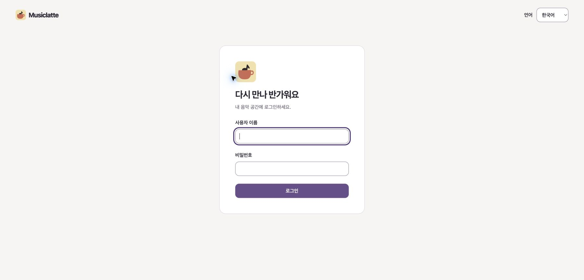
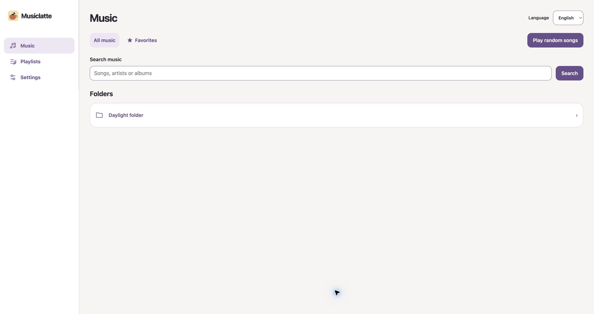

# Musiclatte Server

[한국어](README.ko.md) · [MIT License](LICENSE)

Musiclatte Server is a self-hosted web player and management layer for
[gonic](https://github.com/sentriz/gonic). Browse and play your personal music library from a
clean web interface, then add imports, metadata editing, listening history, mixes, and other
features only when you need them.

Musiclatte keeps the music mounted read-only in the base installation. It preserves gonic's
Subsonic-compatible `/rest` API, so existing compatible clients can continue to use the same
server origin.

## Screenshots





All screenshots use local synthetic fixtures. They contain no production server address, real
account, private library metadata, album artwork, or copyrighted music.

## What it provides

- Responsive Korean and English web interface
- Music browsing, search, favorites, playlists, and playback
- gonic-compatible authentication and Subsonic API routing
- Optional listening history, mixes, stream quality, and artist information
- Optional YouTube imports, metadata editing, and metadata automation
- Docker Compose deployment with project-scoped persistent volumes

## Quick start

### Requirements

- Docker Engine with Docker Compose v2
- An existing directory containing music that Docker can read
- Git

No host Node.js installation is needed for the container setup.

### 1. Download and configure

```sh
git clone https://github.com/yellowgg2/musiclatte-server.git
cd musiclatte-server
cp .env.example .env
```

Set these two values in `.env`:

```dotenv
MUSIC_PATH=/absolute/path/to/your/music
SESSION_MAX_AGE_SECONDS=2592000
```

`MUSIC_PATH` must already exist and must be an absolute path. The example session lifetime is 30
days. Keep the configured `COMPOSE_PROJECT_NAME` stable when upgrading because it identifies this
installation's volumes.

### 2. Start the loopback-only installation

```sh
docker compose -f compose.yaml -f deploy/compose.test.yaml config --quiet
docker compose -f compose.yaml -f deploy/compose.test.yaml up -d --build
docker compose -f compose.yaml -f deploy/compose.test.yaml ps
```

This profile is intended for initial setup and local use on the same machine. It binds the
Musiclatte gateway to `127.0.0.1:8080` and gonic administration to `127.0.0.1:4748`.

### 3. Secure gonic and sign in

1. Open `http://127.0.0.1:4748`.
2. Follow the [gonic first-run instructions](https://github.com/sentriz/gonic#installation) and
   immediately change the initial administrator password.
3. Create a separate non-administrator account for listening.
4. Open Musiclatte at `http://127.0.0.1:8080` and sign in with that account.

For a remote host, keep the administration port private and use an SSH tunnel for initial setup:

```sh
ssh -L 4748:127.0.0.1:4748 your-server
```

Then open `http://127.0.0.1:4748` locally. Never publish the gonic administration port through a
public reverse proxy.

## Optional features

The base installation provides the web player and gonic gateway. Add only the overlays you need.
The examples below retain the loopback-only quick-start profile; omit `deploy/compose.test.yaml`
only after configuring a production HTTPS profile. Compose files must be passed in the displayed
order on every command for that installation.

| Feature              | What it adds                                                                                                   | Compose overlay                  | Setup guide                                                     |
| -------------------- | -------------------------------------------------------------------------------------------------------------- | -------------------------------- | --------------------------------------------------------------- |
| Listening experience | Local listening history, mixes, stream-quality selection, artist information, and optional scrobble forwarding | `deploy/compose.listening.yaml`  | [Listening architecture](docs/architecture/listening-web.md)    |
| YouTube imports      | A worker that downloads approved media into a configured library-relative directory                            | `deploy/compose.imports.yaml`    | [Import deployment](docs/architecture/import-deployment.md)     |
| Metadata editing     | Title, artist, album, cover, and other tag changes with private recovery data                                  | `deploy/compose.metadata.yaml`   | [Metadata deployment](docs/architecture/metadata-deployment.md) |
| Metadata automation  | Policy-controlled review and organization jobs; requires the import and metadata overlays                      | `deploy/compose.automation.yaml` | [Metadata automation](docs/architecture/metadata-automation.md) |

### Listening experience

This is the simplest optional feature and adds no worker or persistent volume:

```sh
docker compose \
  -f compose.yaml \
  -f deploy/compose.listening.yaml \
  -f deploy/compose.test.yaml \
  up -d --build
```

Qualified plays may be forwarded to an external scrobbling service only when the user has already
connected one in gonic. Turning the overlay off stops new Musiclatte listening records but does not
delete existing data.

### YouTube imports

Imports require a dedicated scan-capable gonic account, a private credential file, a private policy
file, and narrowly scoped write access to the destination music directory. Start from
[`deploy/import-policy.example.json`](deploy/import-policy.example.json), keep populated policy and
credential files outside the repository, and follow the
[import deployment guide](docs/architecture/import-deployment.md) before starting the worker.

```sh
docker compose \
  -f compose.yaml \
  -f deploy/compose.imports.yaml \
  -f deploy/compose.test.yaml \
  up -d --build
```

### Metadata editing and automation

Metadata editing is independent of imports. The API continues to mount music read-only; a dedicated
worker owns file changes and private recovery artifacts.

```sh
docker compose \
  -f compose.yaml \
  -f deploy/compose.metadata.yaml \
  -f deploy/compose.test.yaml \
  up -d --build
```

Automation requires both worker overlays and an owner-only automation policy. Follow the metadata
deployment and automation guides before enabling this combination:

```sh
docker compose \
  -f compose.yaml \
  -f deploy/compose.imports.yaml \
  -f deploy/compose.metadata.yaml \
  -f deploy/compose.automation.yaml \
  -f deploy/compose.test.yaml \
  up -d --build
```

Do not commit populated credentials, policies, backups, downloaded media, or runtime data.

## LAN and production access

The quick start intentionally listens only on loopback and uses local HTTP. For production, place
the gateway behind an operator-managed HTTPS reverse proxy, set `PUBLIC_ORIGIN` to its exact public
HTTPS origin, and set `WEB_UI_ENABLED=true` after completing the initial gonic setup. Do not proxy
the gonic administration port.

When the proxy can reach the loopback gateway directly, the production base command is
`docker compose up -d --build` after validating the completed `.env` with
`docker compose config --quiet`.

If a reverse proxy in another container cannot reach host loopback, complete the gonic password
change first, then configure `LAN_BIND_ADDRESS`, `PRODUCTION_LAN_PORT`, and
`ADMIN_SETUP_COMPLETE=true` and add `deploy/compose.production-lan.yaml`:

```sh
docker compose -f compose.yaml -f deploy/compose.production-lan.yaml config --quiet
docker compose -f compose.yaml -f deploy/compose.production-lan.yaml up -d --build
```

For an explicitly trusted private-LAN development setup, use
`deploy/compose.lan-development.yaml`. Add `deploy/compose.lan-admin.yaml` only when gonic account
administration from that trusted LAN is required. Both profiles require the initial password change
first; `ADMIN_SETUP_COMPLETE=true` records that operator action but cannot perform or verify it.

## Updates and backups

`docker compose stop` and `docker compose start` preserve this installation's named volumes. Before
an update, stop the relevant services and create a matching snapshot of the management database,
key, gonic state, and any writable music data. Follow the
[backup and restore guide](deploy/backup/README.md). Do not use `docker compose down -v` as routine
cleanup, and do not downgrade only an image while keeping a newer database.

## Development

Use Node **24.20.0** and npm **11.19.0** through a project-specific version manager or shell.
`.nvmrc` and `.node-version` pin the expected runtime.

```sh
npm ci
npm run typecheck
npm run test:unit -- tests/unit/workspace.test.ts apps/api/test/runtime.test.ts
npm run test:contract -- tests/contract/deployment.test.ts tests/contract/gateway-parity.test.ts
npm run build
```

See the [runtime documentation](docs/architecture/runtime.md) and
[authentication/API contract](docs/architecture/auth-api.md) for development configuration.

## Security and privacy

- Keep `.env`, credentials, policies, backups, music, and runtime databases out of Git.
- Mount the base music library read-only and grant workers only the paths they must change.
- Change the initial gonic administrator password before enabling LAN or proxy access.
- Use a separate non-administrator account for everyday listening.
- Keep the gonic administration port private.
- Review tracked files and Git history for secrets and personal media before publishing a fork.

Third-party components retain their own terms; see
[THIRD_PARTY_NOTICES.md](THIRD_PARTY_NOTICES.md).

## License

Musiclatte Server is licensed under the [MIT License](LICENSE).
